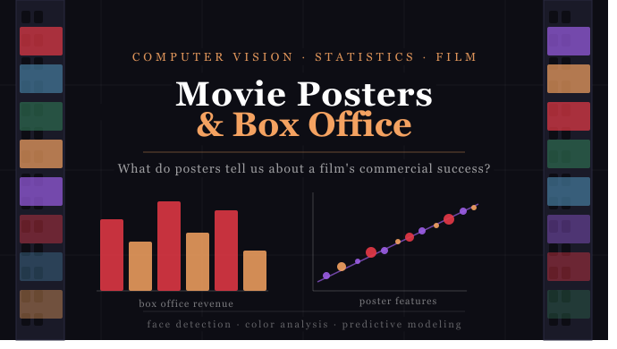

# Can You Judge a Movie's Success by Its Poster?
### DS 4002 Case Study by Rowan Rosenblum



## Overview

This case study challenges you to investigate whether the visual characteristics of a movie poster, its color palette, brightness, saturation, and number of faces, can predict worldwide box office revenue. Using a dataset of ~1,000 films with pre-extracted poster features, you will perform exploratory data analysis, build regression models, and evaluate predictive performance.

---

## Repository Structure

```
CS3-DS4002/
├── README.md
├── LICENSE
├── CS3-Movie-Poster-Hook.md          # Hook document (1-page mission brief)
├── CS3Rubric.md                       # Rubric with deliverable specs
├── DATA/
│   ├── sample_poster_features.csv     # Pre-extracted features for ~1,000 films
│   ├── MASTER_RELEASE_SCHEDULE_UPDATE4.csv # Original starter file, has all films
│   ├── ALL_POSTER_METADATA.csv            # Poster metadata for films with valid financial data           
│   ├── FEATURE_ENGINEERED_DATA_ALL.csv    # Original finalized dataset with all features
│   ├── DATA_DICTIONARY.md             # Variable definitions
│   └── DATA_PREPARATION.md            # How to obtain/expand the dataset
├── SCRIPTS/
│   ├── helper_functions.py            # Utility functions for feature extraction
│   └── starter_analysis.ipynb         # Starter notebook with TODOs
└── SUPPLEMENTAL_MATERIALS/
    ├── blog_explainer.md              # Motivational explainer article
    └── poster_collage.png             # Header image

```

---

## Getting Started

# NOTE: The following steps are for students that want to operate on a reduced sample dataset. The original analysis was performed using the MASTER_RELEASE_SCHEDULE_UPDATE4.csv file, which had data for 80,000+ films. From this, only films with valid financial data (from Box Office Mojo) were selected, and their poster metadata was collected and stored in the file ALL_POSTER_METADATA.csv. In addition, the dataset FEATURE_ENGINEERED_DATA_ALL.csc contains the 21,000+ films, their poster metadata, in addition to more extracted visual features and the revenue variables. These datasets are included if the student wishes to expand their analysis to more films (and get vastly different results than if the student were to only operate on the sample dataset mentioned below). These files are also included if some part of the movie poster/information extraction from TMDb and Box Office Mojo fails, for the FEATURE_ENGINEERED_DATA_ALL.csv contains all of the films and variables needed for a complete statistical analysis without having to scrape any information. Note also, however, that the datasets mentioned above contain many variables not relevant to this project. The relevant variables are listed in the Data Dictionary.

1. **Read the Hook** — `CS3-Movie-Poster-Hook.md` sets the scene and your mission.
2. **Read the Rubric** — `CS3Rubric.md` details exactly what to produce and how you'll be evaluated.
3. **Explore the Data** — Start with `DATA/sample_poster_features.csv` and review the `DATA_DICTIONARY.md`.
4. **Open the Starter Notebook** — `SCRIPTS/starter_analysis.ipynb` has a structured template with TODOs.
5. **Use the Helper Functions** — `SCRIPTS/helper_functions.py` provides utilities for feature extraction if you want to expand the dataset.

---

## Data

The `DATA/` folder contains:
- **sample_poster_features.csv** — Pre-extracted visual features for ~1,000 films including dominant colors (RGB), average brightness, average saturation, orange-teal score, face density, and worldwide box office revenue.
- **DATA_DICTIONARY.md** — Complete variable definitions for every column.
- **DATA_PREPARATION.md** — Step-by-step instructions for downloading poster images from TMDB and extracting features yourself if you want to scale up.
- **MASTER_RELEASE_SCHEDULE_UPDATE4.csv** — Original data file that this project was based on, contains over 80,000 films with data from TMDb and Box Office Mojo. Most variables are not relevant for this project.
- **ALL_POSTER_METADATA.csv** — Poster metadata for all films with valid financial data from the MASTER_RELEASE_SCHEDULE_UPDATE4.csv file, includes 21,000+ films.           
- **FEATURE_ENGINEERED_DATA_ALL.csv** — Finalized dataset from the original project, contains the 21,000+ films, their extracted visual features, financial information, and many other derived variables which are outside the scope of this project and/or not relevant. 

---

## Reference Materials

**Chu, W.-T. & Guo, H.-J.** (2017). Movie Genre Classification based on Poster Images with Deep Neural Networks. *Proceedings of the Workshop on Multimodal Understanding of Social, Affective and Subjective Attributes (MUSA2)*, 39–45. [https://doi.org/10.1145/3132515.3132516](https://doi.org/10.1145/3132515.3132516)

**TMDB.** (2024). The Movie Database API Documentation. [https://developer.themoviedb.org/docs](https://developer.themoviedb.org/docs)

**Scikit-learn.** (2024). Random Forest Regressor Documentation. [https://scikit-learn.org/stable/modules/generated/sklearn.ensemble.RandomForestRegressor.html](https://scikit-learn.org/stable/modules/generated/sklearn.ensemble.RandomForestRegressor.html)

Additional reference materials including a blog-style explainer are available in the `SUPPLEMENTAL_MATERIALS/` folder.

